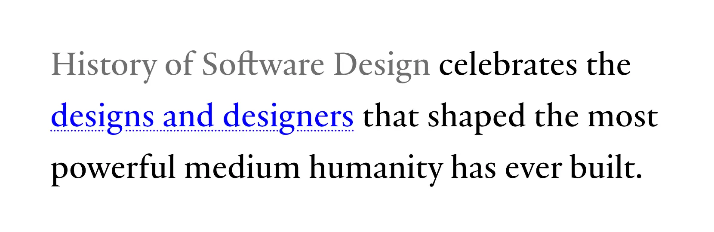

If you’ve been thinking about building your own personal blog, the tooling choices can feel endless. There are so many frameworks, static site generators, and CMSes available today. There’s nothing wrong with any of these, but they can be limiting when it comes to design and functionality.

I wanted something different: a blog that felt <mark>entirely mine</mark>, with full control over the style and every piece of the writing and publishing experience.

This post breaks down how the site works: the stack, the content system, my custom components and styles, and some of the little helpers that make it all feel polished. My site is also entirely open source on [GitHub](https://github.com/bradenr402/portfolio). Feel free to explore the codebase and copy whatever you find useful.

Thanks to Josh W. Comeau for his own post [How I Built My Blog](https://www.joshwcomeau.com/blog/how-i-built-my-blog/), which inspired me to write this one.

---

## The Stack

The stack is intentionally small:

- [**Webpack**](https://webpack.js.org/) for the build and asset pipeline—I created this site several years ago, and it already used Webpack, so it made sense to extend it.
- [**Markdoc**](https://markdoc.io/) for Markdown & custom tags—it even [parses frontmatter](https://markdoc.dev/docs/frontmatter).
- [**js-yaml**](https://github.com/nodeca/js-yaml) for decoding the YAML before Markdoc parses the frontmatter.
- [**JSDOM**](https://github.com/jsdom/jsdom) for manipulating HTML at build time.
- [**highlight.js**](https://highlightjs.org/) for syntax highlighting code blocks at build time.

This blog is entirely static. No database, no API routes, no persistent backend. I prefer the simplicity: if something can be precomputed at build time, it is.

Webpack does the static generation by creating an `HtmlWebpackPlugin` instance for every post:

```javascript
/* webpack.config.js */

const blogPosts = collectBlogPostsMeta(BLOG_DIR);

const blogHtmlPlugins = blogPosts.map((post) => {
  return new HtmlWebpackPlugin({
    filename: `blog/${post.slug}.html`,
    favicon: FAVICON_PATH,
    templateContent: () => {
      let content = fs.readFileSync(post.filePath, 'utf8');

      const processed = processMarkdown(content, post.filePath);
      content = processed.html;
      const metadata = processed.metadata;

      // ... inject content into template

      return applyBaseLayout(pageHtml);
    },
  });
});
```

It’s nothing fancy; just a few moving parts that work well together. Let’s dive into the details of how it all works.

---

## The Secret Ingredient

[Markdoc](https://markdoc.io/) is what makes the blog feel like a custom product. It parses Markdown into an Abstract Syntax Tree (AST), then renders that AST into HTML. This allows me to intercept the parsing process and inject my own logic at various stages.

On top of that, writing in Markdown is simply a much better experience than writing in raw HTML: it’s easier to read and write, it keeps my focus on the content rather than the markup, and I don’t have to worry about wrapping every single paragraph in `<p>` tags.


Josh Comeau mentioned this in his post as well; while I initially had planned to write in HTML, I realized Markdown was the way to go after reading about how awful his experience was. It took more work upfront to set up the Markdoc parsing and my custom logic, but I think it’ll be worth it for the improved writing experience.


Markdoc also has support for custom tags and node transforms, enabling me to build custom components and apply transformations to nodes as they’re being processed. Keep reading to see some examples of how I take advantage of this.

### Custom Components

#### Blog Card

I knew early on that I would want a nice way to reference other posts I’ve written. A plain link works, but can be a bit underwhelming—I wanted to reference other posts in a way that felt alive! So I defined a custom <span class="whitespace-nowrap">``</span> tag which takes a `src` attribute targeting another post:

```md

```

The custom component in `markdoc-config.js` reads the target post’s metadata and injects it into a template. The result is a fully styled card with the post’s title, date, estimated reading time, header image preview, and tags, generated entirely at build time. Here’s how it looks:



The `src` attribute is validated at build time, too: if it points at a post that doesn’t exist, the build fails with the path it expected to find, so I’ll never accidentally ship a dead card.

#### Sidenotes

Sometimes I want to add a tangential remark without derailing the flow of the text—the kind of thing that would traditionally live in a footnote. But footnotes make you jump to the bottom of the page and back, so I built sidenotes instead: small asides that sit right in the flow of the text, close to the words they comment on. You’ve already seen one of them in [The Secret Ingredient](#the-secret-ingredient) section above.

A sidenote comes in two parts: a <span class="whitespace-nowrap">``</span> tag wraps the words the note relates to, and a <span class="whitespace-nowrap">``</span> tag holds the note itself. Both take a required `label` attribute that ties the pair together:

```md 
Sidenotes are handy for tangential remarks.


Like this one—related, but not essential.

```

Which renders as exactly this:

Sidenotes are handy for tangential remarks.


Like this one—related, but not essential.


Because the pairing comes from the label rather than the position, a sidenote doesn’t have to follow the paragraph that references it—it can go anywhere in the document.

That said, I prefer to keep each note close to its reference. A note that shows up three paragraphs after the words it comments on isn’t much better than a footnote.


Case in point: this note comes after the paragraph that follows its reference, and the pairing works just the same.


The numbering happens at build time. Since Markdoc transforms each tag in isolation, no single tag knows how many sidenotes came before it—so after transforming the whole document, I walk the resulting tree, number the references in document order, and give each sidenote the number of the reference that shares its label:

```javascript
// src/helpers/markdown.js

function assignSidenoteNumbers(root) {
  // ... walk the transformed tree, collecting `refs` and `notes`

  const numbersByLabel = new Map();

  refs.forEach((ref, index) => {
    const number = index + 1;

    ref.attributes['data-sidenote'] = number;
    numbersByLabel.set(ref.attributes.label, number);
  });

  notes.forEach((note) => {
    const number = numbersByLabel.get(note.attributes.label);

    note.attributes['data-sidenote'] = number;
    note.attributes['aria-label'] = `Sidenote ${number}`;
  });

  // Remove the `label` attribute from refs and notes
  [...refs, ...notes].forEach(({ attributes }) => delete attributes.label);
}
```

Both elements end up with the same `data-sidenote` attribute, which the CSS uses to render the numbers (via `content: attr(data-sidenote)`) and to highlight the pair whenever either one is hovered—no JavaScript required. There’s one wrinkle, though: CSS can’t compare attribute values across elements, so the hover pairing is enumerated, one `:has()` rule per number:

```css
/* src/blog.css */

.sidenote-ref::after,
.sidenote::before {
  content: attr(data-sidenote);
}

:scope {
  &:has([data-sidenote='1']:hover) [data-sidenote='1'],
  &:has([data-sidenote='2']:hover) [data-sidenote='2'],
  /* ... */
  &:has([data-sidenote='10']:hover) [data-sidenote='10'] {
    color: var(--color-accent);
    text-decoration-color: var(--color-accent);
  }
}
```

Ten is an arbitrary ceiling—if a post ever needs more sidenotes than that, it probably needs an editor more than it needs another selector. Try hovering this live example and watch the note below light up. Consecutive sidenotes get some special treatment too: notes attached to the same paragraph stack flush against each other and share a single divider, rather than doubling up the borders between them.


Hover this note and you’ll see its reference above light up too. Everything here—the numbers, the pairing, the hover effect—is pure CSS on top of two build-time-injected attributes.



Notice the single shared divider between this note and the one above.


The labels are validated at build time, too: each one must appear on exactly one reference and exactly one note, so a typo won’t accidentally break a `sidenote`–`sidenote-ref` pairing—the build fails and tells me exactly where:

```text 
Invalid Markdoc content:
  [error]  label 'tangent' has no matching  (line 42)
```

I’d much rather have the build yell at me than ship a broken post.

### Node Transforms

#### Links

I usually want external links to open in a new tab via `target="_blank"`, but sometimes I want to override this. Unfortunately, Markdown doesn’t support this natively, so I wrote a custom Markdoc transform that processes every link node:

```javascript
// src/helpers/markdoc-config.js

export default {
  nodes: {
    // Custom link node to automatically open external links in a new tab
    link: {
      render: 'a',
      attributes: {
        href: { type: String },
        title: { type: String },
      },
      transform(node, config) {
        const attributes = node.transformAttributes(config);
        const children = node.transformChildren(config);

        const href = attributes.href || '';

        const isNewTab = href.startsWith('newtab:');
        const isSameTab = href.startsWith('sametab:');
        const isExternal = href.startsWith('http');

        if (isNewTab || (!isSameTab && isExternal)) {
          attributes.target = '_blank';
          attributes.rel = 'noopener noreferrer';
        }

        attributes.href = href.replace(/^(new|same)tab:/, '');

        return new Tag('a', attributes, children);
      },
    },
    // other node transforms...
  },
};
```

Here’s how it works:

- **Default behavior**:
  - External links (starting with `http`) open in a new tab:  
    `[Google](https://www.google.com)` <i data-icon="arrow-right" class="inline size-4"></i> `<a href="https://www.google.com" target="_blank">Google</a>`
  - Internal links open in the same tab:  
    `[Home](/)` <i data-icon="arrow-right" class="inline size-4"></i> `<a href="/">Home</a>`
- **Overrides**:
  - Prepending `newtab:` to the URL forces an internal link to open in a new tab:  
    `[Home](newtab:/)` <i data-icon="arrow-right" class="inline size-4"></i> `<a href="/" target="_blank">Home</a>`
  - Prepending `sametab:` to the URL forces an external link to open in the _same_ tab:  
    `[Google](sametab:https://​google.com)` <i data-icon="arrow-right" class="inline size-4"></i> `<a href="https://​google.com">Google</a>`

#### Lists

I built a custom Markdoc transform that processes every list item node, wrapping the contents of all `<li>` elements in a `<div>`:

```javascript
// src/helpers/markdoc-config.js

export default {
  nodes: {
    // Custom list item node to wrap content in a div for better styling
    item: {
      render: 'li',
      transform(node, config) {
        const attributes = node.transformAttributes(config);
        const children = node.transformChildren(config);
        return new Tag('li', attributes, [new Tag('div', {}, children)]);
      },
    },
    // other node transforms...
  },
};
```

This wrapper `<div>` ensures text is aligned properly for multi-line items—since I’m using custom markers with CSS counters ([more on that later](#clear--intuitive-links)) and applying `ol, ul { display: flex; }` to align the markers vertically, things can get a little messy without that `<div>` wrapper around the text content.

Here’s an example of the markdown for a nested list:

```md
1. First item
2. Second item
   - Nested item
```

Which is converted to the following markup:

```html
<ol>
  <li><div>First item</div></li>
  <li>
    <div>
      Second item
      <ul>
        <li>
          <div>Nested item</div>
        </li>
      </ul>
    </div>
  </li>
</ol>
```

And here’s how it looks:

1. First item
2. Second item
   - Nested item

Without wrapping the content in a `<div>`, the nested list item would appear beside the “Second item” text, which is not what I want:

<ol>
  <li>First item</li>
  <li>
    Second item
    <ul>
      <li>
        Nested item
      </li>
    </ul>
  </li>
</ol>

The extra `<div>` wrapper ensures proper block layout within the flex container.

#### Tables

To prevent tables from breaking mobile layouts, I have a transform that wraps every `<table>` in a container div (`.table-wrapper`). This lets the table scroll horizontally on small screens without breaking the layout of the page itself.

```javascript
// src/helpers/markdoc-config.js

export default {
  nodes: {
    // Custom table node to wrap tables in a div container for responsive styling
    table: {
      render: 'table',
      transform(node, config) {
        const attributes = node.transformAttributes(config);
        const children = node.transformChildren(config);
        return new Tag('div', { class: 'table-wrapper' }, [new Tag('table', attributes, children)]);
      },
    },
    // other node transforms...
  },
};
```

##### Markdoc Table Syntax

Markdoc provides a nice [list-based table syntax](https://markdoc.dev/docs/tags#table) that differs from standard Markdown tables. Instead of cramming each row onto a single line delimited by pipes (`|`), you write each row as a list, separated by a horizontal rule (`---`). Each cell in the row is simply a list item, so it can contain full Markdown content.

I love this for complex tables. It’s far easier to read, write, and maintain, and it lets cells hold richer content—paragraphs, lists, code blocks, even custom attributes—instead of flattening every row into one line.

Here’s an example of how I would write a complex table with Markdoc syntax, rendered below:

````md 


- Capability 
- Markdown supports?
- Markdoc supports?
- Notes

---

- Simple text
- Supported 
- Supported 
- Plain text renders normally in both Markdown and Markdoc tables.

---

- Inline formatting
- Supported 
- Supported 
- _Italic_, **bold**, `inline code`, and [links](#).

---

- Multiple paragraphs
- Supported 
- Limited;  
  Only raw HTML 
- This is the first paragraph.

  This is the second paragraph.

---

- Lists
- Supported 
- Limited;  
  Only raw HTML 
- 1. Easy to write
  2. Easy to edit
     - Supports nesting

---

- Code blocks
- Supported 
- Not supported;  
  Only inline code 
- ```ruby
  user = User.find_by(email: email)
  user.update(name: "Braden")
  ```

---

- Cell attributes
- Supported 
- Not supported 
- Add custom attributes, like classes: ``. 


````



- Capability 
- Markdown supports?
- Markdoc supports?
- Notes

---

- Simple text
- Supported 
- Supported 
- Plain text renders normally in both Markdown and Markdoc tables.

---

- Inline formatting
- Supported 
- Supported 
- _Italic_, **bold**, `inline code`, and [links](#).

---

- Multiple paragraphs
- Supported 
- Limited;  
  Only raw HTML 
- This is the first paragraph.

  This is the second paragraph.

---

- Lists
- Supported 
- Limited;  
  Only raw HTML 
- 1. Easy to write
  2. Easy to edit
     - Supports nesting

---

- Code blocks
- Supported 
- Not supported;  
  Only inline code 
- ```ruby
  user = User.find_by(email: email)
  user.update(name: "Braden")
  ```

---

- Cell attributes
- Supported 
- Not supported 
- Add custom attributes, like classes: ``. 



Standard Markdown tables are great for simple, single-line data. But once a cell needs structured content, the format becomes restrictive, forcing you to lose formatting or resort to raw HTML.

My rule: reach for a standard table when the data is simple, and Markdoc the moment a cell needs to do more.

#### Skipping Headings in Table of Contents

Sometimes I have headings that I don’t want to appear in the table of contents (TOC). To handle this, I set up a transform so I can add a `data-toc-skip="true"` attribute to any heading I want to exclude:

```javascript
// src/helpers/markdoc-config.js

export default {
  nodes: {
    // Custom heading node to support data-toc-skip attribute
    heading: {
      children: ['inline'],
      attributes: {
        'data-toc-skip': { type: Boolean },
      },
      transform(node, config) {
        const attributes = node.transformAttributes(config);
        const children = node.transformChildren(config);
        return new Tag(`h${node.attributes.level}`, attributes, children);
      },
    },
    // other node transforms...
  },
};
```

Then I filter out those headings when building the TOC. Here’s an example:

```md 
### Heading to Include

### Heading to Exclude 
```

Which is converted to the following markup:

```html
<h3>Heading to Include</h3>

<h3 data-toc-skip="true">Heading to Exclude</h3>
```

---

## Metadata

### Dates from File Path

I knew from the start that I did **NOT** want to manually manage dates in frontmatter. It’s tedious, easy to forget, and I knew eventually it would come back to bite me. Instead, the file path is the source of truth. A file at `src/blog/2026/01/26/my-post.md` is dated as “January 26, 2026” automatically, via this small but nifty helper:

```javascript
/* src/helpers/blog-build.js */

function extractDateFromPath(pathStr) {
  const match = pathStr.match(/(?<year>\d{4})\/(?<month>\d{2})\/(?<day>\d{2})\//);
  if (match) {
    const { year, month, day } = match.groups;
    return [year, month, day].join('-');
  }
}
```

Frontmatter stays minimal, and the date always matches with where the file lives.

### Skipping Action Buttons

If you scroll to the bottom of this post, you’ll see a couple buttons to copy the URL or scroll back to the top. However, I don’t want these on every post—only some of them. To solve this, I added a `skip_actions` frontmatter flag. If it’s set to `true`, those buttons are omitted. Take a look at my “Hello, World” post, and you’ll notice that the action buttons at the bottom are omitted:



---

## Blog Index

On the `/blog` page, I have a chronological list of posts, which is generated at build time. The build process scans `src/blog/`, extracts metadata, and generates the list.

The underlying idea is simple:

1. Read all `.md` files under `src/blog/`.
2. Parse frontmatter and infer the date from the file path.
3. Sort posts by date from newest to oldest.
4. Inject into the index template.

No need for anything more complicated than that.

---

## Styling & Polish

I wanted the blog to feel polished and intentional, so I added a lot of custom styles and little details to make the reading experience enjoyable. Continue reading to see some examples and the CSS techniques I used to achieve them.

### Scoped Styles

I use CSS `@scope` to isolate the blog’s design. This ensures that typography and layout rules apply only to the blog content (`.prose`) and explicitly stop at any element with the class `.prose-reset`.

```css
/* src/blog.css */

@scope (.prose) to (.prose-reset) {
  /* Blog styles here... */
}
```

This [Donut Scope](https://css-tricks.com/solved-by-css-donuts-scopes/) is perfect for embedding custom components or interactive demos within a post. By wrapping them in `.prose-reset`, I ensure they aren’t affected by the blog’s global styles, giving me a blank canvas for those specific elements.

For example, I can easily embed this custom HTML styled with Tailwind from the [homepage](/) of my site without any style conflicts:

#### Example of a section wrapped in `.prose-reset`:

<div class="prose-reset p-6 border border-(--color-border)">
  <div class="photo-gallery sm:[--gallery-columns:3]">
    <figure class="photo-card [--hover-rotation:-4deg] [--hover-x:-2] [--hover-y:-1] [--initial-rotation:-9deg] [--initial-y:3] [--z:1]">
      <div class="photo-card-inner">
        
        <figcaption>Our Wedding</figcaption>
      </div>
    </figure>
    <figure class="photo-card [--hover-rotation:-2deg] [--hover-y:-6] [--initial-rotation:1deg] [--initial-y:-2] [--z:4]">
      <div class="photo-card-inner">
        
        <figcaption>Welcome, Emily!</figcaption>
      </div>
    </figure>
    <figure class="photo-card [--hover-rotation:3deg] [--hover-x:2] [--hover-y:-2] [--initial-rotation:7deg] [--initial-y:3] [--z:2]">
      <div class="photo-card-inner">
        
        <figcaption>Emily’s First Xmas</figcaption>
      </div>
    </figure>
    <figure class="photo-card [--hover-rotation:-3deg] [--hover-x:-3] [--hover-y:0] [--initial-rotation:-5deg] [--initial-x:0] [--initial-y:-1.5] [--z:5]">
      <div class="photo-card-inner">
        
        <figcaption>Welcome, Sophia!</figcaption>
      </div>
    </figure>
    <figure class="photo-card [--hover-rotation:3deg] [--hover-x:4] [--hover-y:1.5] [--initial-rotation:9deg] [--initial-x:0] [--initial-y:-1] [--z:3] max-sm:translate-y-2">
      <div class="photo-card-inner">
        
        <figcaption>Sophia’s First Xmas</figcaption>
      </div>
    </figure>
  </div>
</div>

Without `@scope`, the styles from the blog would bleed into this section, causing visual inconsistencies. The difference is quite obvious if I remove the `prose-reset` wrapper.

#### Example of a section without `.prose-reset`:

<div class="p-6 border border-(--color-border)">
  <div class="photo-gallery sm:[--gallery-columns:3]">
    <figure class="photo-card [--hover-rotation:-4deg] [--hover-x:-2] [--hover-y:-1] [--initial-rotation:-9deg] [--initial-y:3] [--z:1]">
      <div class="photo-card-inner">
        
        <figcaption>Our Wedding</figcaption>
      </div>
    </figure>
    <figure class="photo-card [--hover-rotation:-2deg] [--hover-y:-6] [--initial-rotation:1deg] [--initial-y:-2] [--z:4]">
      <div class="photo-card-inner">
        
        <figcaption>Welcome, Emily!</figcaption>
      </div>
    </figure>
    <figure class="photo-card [--hover-rotation:3deg] [--hover-x:2] [--hover-y:-2] [--initial-rotation:7deg] [--initial-y:3] [--z:2]">
      <div class="photo-card-inner">
        
        <figcaption>Emily’s First Xmas</figcaption>
      </div>
    </figure>
    <figure class="photo-card [--hover-rotation:-3deg] [--hover-x:-3] [--hover-y:0] [--initial-rotation:-5deg] [--initial-x:0] [--initial-y:-1.5] [--z:5]">
      <div class="photo-card-inner">
        
        <figcaption>Welcome, Sophia!</figcaption>
      </div>
    </figure>
    <figure class="photo-card [--hover-rotation:3deg] [--hover-x:4] [--hover-y:1.5] [--initial-rotation:9deg] [--initial-x:0] [--initial-y:-1] [--z:3] max-sm:translate-y-2">
      <div class="photo-card-inner">
        
        <figcaption>Sophia’s First Xmas</figcaption>
      </div>
    </figure>
  </div>
</div>

The blog styles are leaking into the images in the component, messing up the layout, the image styles, and even the color of the captions. The first example (with `.blog-reset`) retains the intended design of that section, while the second example (without `.blog-reset`) is affected by the blog’s styles bleeding into it, disrupting the intended design.

### Heading Links & Table of Contents

Every `h2`-`h6` gets an auto-generated ID and a small anchor icon on hover. Try hovering over any heading in this post to see it. Those headings also power the sidebar table of contents, which you can see to the right (if you’re on desktop).

During the Markdoc parsing phase, a function traverses the AST and builds a tree of all the headings found in the document. This tree is then rendered as a nested list in the sidebar. If a post has fewer than three headings, the Table of Contents is omitted to keep the layout clean.

### Clear & Intuitive Links

Links have different styles depending on their destination.

- Internal links have a dotted underline and change color on hover: [Home](/)
- External links have an arrow appended, which animates on hover: [Google](https://google.com)
- Email links have a mail icon prepended, which opens on hover: [Email](mailto:me@bradenroth.com)

### Custom Highlights

The default browser yellow highlight for `<mark>` elements is&hellip; <span style="background-color: yellow; color: black;">a bit harsh</span>. So I added a custom style for them that fits better with the overall design, along with some additional fun color options, which I can easily apply with classes like `.green`, `.red`, or `.purple`.

Text highlights are a <mark class="yellow">great way</mark> to draw <mark class="orange">attention</mark> to <mark class="purple">important points</mark> or <mark class="green">key takeaways</mark>. You can also use them for a little bit of <mark class="pink">stylistic flair</mark>, or for warnings. For example: <mark class="red">don’t include six highlights in a single paragraph!</mark>

Highlights use `box-decoration-break: clone` to ensure highlights that span multiple lines look continuous across line breaks, without any awkward gaps. <mark>Here’s a really long one to demonstrate that effect. Notice how the highlight wraps around the text smoothly, even as it breaks across lines.</mark> These are the kinds of details that I obsess over. Without `box-decoration-break: clone`, <mark class="red" style="box-decoration-break: initial">the highlight would have flat edges at each line break, which can look a bit disjointed.</mark>

> Imagine using highlights inside blockquotes to give the reader the feeling of a <mark class="yellow">highlighter pen annotating a physical book</mark>. This adds a tactile, personal touch to the content, making it feel more engaging and less like a standard web page. The web should be a place of <mark class="pink">beauty</mark> and <mark class="purple">personality</mark>, not just a sea of black text on a white background!

### Text Selection

In the same vein as custom highlights, I also wanted to make the text selection experience a little nicer. By chance, I recently came across [History of Software Design](https://historyofsoftware.org/), which has a really nice text selection style that changes the color of the text and adds a dashed underline:

<figure>
  
  <figcaption>Text selection effect on [History of Software Design](https://historyofsoftware.org/)</figcaption>
</figure>

I loved the effect and decided to implement something similar on my site.

Since I wanted this to apply across my entire site (not just the blog), I defined a custom selection style in my global stylesheet using the `::selection` pseudo-element:

```css
/* src/theme.css */
@theme {
  --selection-color: oklch(from var(--color-primary-500) l c h / 5%);
}

/* src/style.css */
::selection {
  background: var(--selection-color);
  color: var(--color-accent);
  text-decoration: dotted underline var(--color-accent);
  text-decoration-thickness: 1px;
  text-underline-offset: 2px;
}
```

I opted for a `dotted` underline instead of `dashed` to prevent the underline from shifting around too much as the selection changes. The color and underline alone still felt just a little too subtle, so I added a mostly-transparent background color to make it a bit more obvious when text is selected. Go ahead and try selecting some text in this post to see the effect.

### Images & Figures

Images are centered and have a nice frame with a subtle border and shadow to make them pop off the page. The corners are ever-so-slightly rounded to give them a softer, more polished look. Here’s an example from [placehold.co](https://placehold.co):


Figures can include captions:

<figure>
  
  <figcaption>Example image from [Placehold](https://placehold.co).</figcaption>
</figure>

### Prettier Lists

List markers are quite limited in how they can be styled with CSS. I wanted more control, so I disabled the default markers and instead used CSS counters to create custom markers. This allows for more flexible styling, including custom fonts, colors, and sizes. Here are some examples:

#### Unordered List:

- Item 1
- Item 2
  - Nested Item 1
  - Nested Item 2

#### Ordered List:

1. First item
2. Second item
   1. Nested item A
   2. Nested item B

#### Mixed List:

1. First item
   - Nested item A
   - Nested item B
2. Second item
   - Nested item C
   - Nested item D
     1. Deeply nested item i
     2. Deeply nested item ii
        - Even deeper item α
        - Even deeper item β

### Blockquotes That Actually Look Like Quotes

Blockquotes get justified text, a distinct background, and a decorative `“` so they feel like a different “voice,” not just italic text:

> Here’s to the crazy ones. The misfits. The rebels. The troublemakers. The round pegs in the square holes. The ones who see things differently. They’re not fond of rules. And they have no respect for the status quo. You can quote them, disagree with them, glorify or vilify them. About the only thing you can’t do is ignore them. Because they change things. They push the human race forward. And while some may see them as the crazy ones, we see genius. Because the people who are crazy enough to think they can change the world, are the ones who do.
>
> <cite>Steve Jobs</cite>

### Beautiful Code

You’ve already seen multiple examples of inline `code` and code blocks in this post. I wanted to make those feel special, so I added a few enhancements: syntax highlighting & copy buttons.

#### Syntax Highlighting

I highlight code blocks at build time using [highlight.js](https://highlightjs.org/). The browser never sees the raw code—just the already-colored HTML:

```javascript
/* src/helpers/apply-base-layout.js */

function highlightCodeBlocks(html) {
  const dom = new JSDOM(html);
  const codeBlocks = dom.window.document.querySelectorAll('pre > code');

  for (const codeEl of codeBlocks) {
    const classList = Array.from(codeEl.classList);
    const langClass = classList.find((c) => c.startsWith('language-'));
    const explicitLang = langClass?.replace(/^language-/, '');

    const codeText = codeEl.textContent || '';
    if (!codeText.trim()) continue;

    let result;
    if (explicitLang && hljs.getLanguage(explicitLang)) {
      result = hljs.highlight(codeText, { language: explicitLang });
    } else {
      result = hljs.highlightAuto(codeText);
    }

    codeEl.innerHTML = result.value;

    codeEl.classList.add('hljs');
    const finalLang = explicitLang || result.language;
    if (finalLang) codeEl.classList.add(`language-${finalLang}`);
  }

  return dom.serialize();
}
```

#### Code Copy Buttons

Have you ever been reading a blog post and had to manually select a code block with your mouse to copy it, only to accidentally select some extra text or miss a few characters? It’s frustrating! With these copy buttons, you can just click the button and the entire code block is copied to your clipboard. Try it out with the conveniently-placed code block below:

```javascript
// src/helpers/init-code-copy-buttons.js

codeBlocks.forEach((codeBlock) => {
  const button = document.createElement('button');
  // assign button attributes and content

  button.addEventListener('click', async () => {
    await navigator.clipboard.writeText(codeBlock.textContent);
    // trigger animation
  });

  wrapper.appendChild(button);
});
```

### Keyboard Tags

I like to use `<kbd>` tags to denote keyboard shortcuts. I designed custom styles for `<kbd>` elements adapted from [this post by Dylan Smith](https://dylanatsmith.com/wrote/styling-the-kbd-element) to make them look more like physical keys, with subtle hover and click effects. `<kbd>` elements also react to keypresses. When you press a key that matches the content of a `<kbd>`, it animates as if it were being pressed.

For example, press <kbd>⌘</kbd> + <kbd>⇧</kbd> + <kbd>R</kbd> to force refresh the page. Or press <kbd>↑</kbd> <kbd>↑</kbd> <kbd>↓</kbd> <kbd>↓</kbd> <kbd>←</kbd> <kbd>→</kbd> <kbd>←</kbd> <kbd>→</kbd> <kbd>B</kbd> <kbd>A</kbd> in sequence for a surprise...

### Smart Tables

Tables scroll horizontally on small screens, and display scroll shadows as a visual cue when the table is scrollable (inspired by [this article](https://css-tricks.com/books/greatest-css-tricks/scroll-shadows/) from CSS-Tricks). With some clever CSS, I can also make the first column sticky by adding a `.sticky` class to the first `<th>` element. Here’s an example of a table with a sticky first column and scroll shadows:



- Heading 1 
- Heading 2
- Heading 3
- Heading 4
- Heading 5
- Heading 6
- Heading 7
- Heading 8
- Heading 9
- Heading 10

---

- Row 1 Cell 1
- Row 1 Cell 2
- Row 1 Cell 3
- Row 1 Cell 4
- Row 1 Cell 5
- Row 1 Cell 6
- Row 1 Cell 7
- Row 1 Cell 8
- Row 1 Cell 9
- Row 1 Cell 10

---

- Row 2 Cell 1
- Row 2 Cell 2
- Row 2 Cell 3
- Row 2 Cell 4
- Row 2 Cell 5
- Row 2 Cell 6
- Row 2 Cell 7
- Row 2 Cell 8
- Row 2 Cell 9
- Row 2 Cell 10

---

- Row 3 Cell 1
- Row 3 Cell 2
- Row 3 Cell 3
- Row 3 Cell 4
- Row 3 Cell 5
- Row 3 Cell 6
- Row 3 Cell 7
- Row 3 Cell 8
- Row 3 Cell 9
- Row 3 Cell 10

---

- Row 4 Cell 1
- Row 4 Cell 2
- Row 4 Cell 3
- Row 4 Cell 4
- Row 4 Cell 5
- Row 4 Cell 6
- Row 4 Cell 7
- Row 4 Cell 8
- Row 4 Cell 9
- Row 4 Cell 10

---

- Row 5 Cell 1
- Row 5 Cell 2
- Row 5 Cell 3
- Row 5 Cell 4
- Row 5 Cell 5
- Row 5 Cell 6
- Row 5 Cell 7
- Row 5 Cell 8
- Row 5 Cell 9
- Row 5 Cell 10

---

- Row 6 Cell 1
- Row 6 Cell 2
- Row 6 Cell 3
- Row 6 Cell 4
- Row 6 Cell 5
- Row 6 Cell 6
- Row 6 Cell 7
- Row 6 Cell 8
- Row 6 Cell 9
- Row 6 Cell 10

---

- Row 7 Cell 1
- Row 7 Cell 2
- Row 7 Cell 3
- Row 7 Cell 4
- Row 7 Cell 5
- Row 7 Cell 6
- Row 7 Cell 7
- Row 7 Cell 8
- Row 7 Cell 9
- Row 7 Cell 10



### Horizontal Rules

Horizontal rules are used to separate sections. If you look closely, you’ll see that the left and right edges are rounded, giving them a softer, more polished look:

---

### Icons Without an Icon Library

I’m picky about icons. I don’t want to include a massive icon set when I won’t use most of them, and I want full control over the icons’ appearance to make sure they fit perfectly with the design.

My solution is a manual “pipeline”. I create/download only the specific SVGs I need and drop them into `src/images/icons/`.

In my code, I just write `<i data-icon="github"></i>`. During the build (again, using JSDOM), the system finds these spans, reads the actual SVG file from the disk, and inlines the SVG code directly into the HTML.

This means no HTTP requests for icons, no massive font files, and perfect control over my icon library. Here’s an example:

**Input:**

```html
<i data-icon="rails" class="size-24"></i>
```

**Output:**
<i data-icon="rails" class="size-24"></i>

## Closing Thoughts

I could have used a modern meta‑framework and avoided a lot of extra work in creating this blog. But this stack gives me unrivaled control over every aspect of my blog, and a writing experience I actually enjoy.

The blog is mine, built the way I want it, and that makes it special to me. It’s my own little corner of the internet, crafted with care and attention to detail—I hope that shines through as you read my posts.
